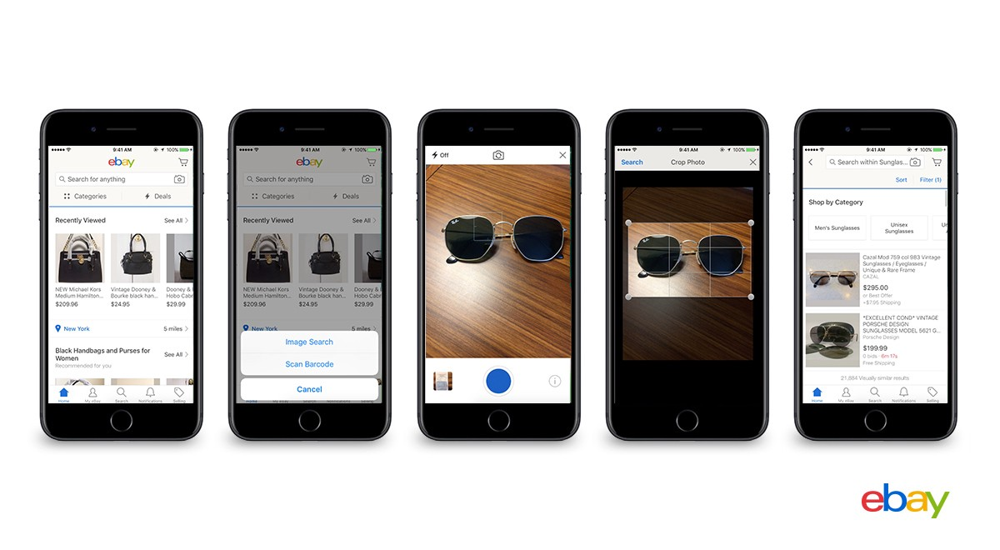

    <h1>
    The Future of E-Commerce: Visual Search	
    </h1>

# 1. Introduction

## Visual Search

Visual Search is the process of searching for something given images. In online shopping, imagine that we can search for a product just by capturing a photo of it and send to the system (for example, a mobile application), without typing in the description of that one, or even sometimes we cannot describe it correctly. Visual search is the future of e-commerce. Many companies applied visual search in their products, such as Shopee, Lazada, Amazon, and Pinterest, too.

How visual searching work in e-commerce ([Source](https://medium.com/@virtua/visual-search-in-e-commerce-41ecf52b66d2))

## Deep Metric Learning
Deep Metric Learning (DML) aims to learn a function mapping images, often in the shape of 3D arrays, into a one-dimension feature space. The learnt function should output low-distance feature vectors with respect to visually similar input images, and vice versa. Classification-based losses are usually used to train a DML model from scratch before switching to time-consuming metric learning losses [1](https://arxiv.org/abs/1811.12649). Hence, for the purpose of demo, here I use a classification-based training method [in this paper](https://arxiv.org/abs/1811.12649) to train my model.

## Object Detection
Object detection is one of the most interesting task in computer vision. It not only detects the location of the objects in a given image, but also classify them into pre-defined categories. In real-life visual search, we may often deal with images containing so much background, and the results of the DML model consequencely could be bad. Taking out the main object in an image, which can be done by a good object detection, can help improve the searching results in these cases.

## This project

In this project, I demonstrated a simple visual search system in e-commerce, using deep metric learning and object detection models. For the sake of demonstration, I used datasets consisting of clothing items only, other products might be applied similarly. I trained a DML model using a classification-based method. The training codes were forked and edited from [this repo](https://github.com/azgo14/classification_metric_learning). Moreover, to handle the noise cases mentioned above, I also employ a pretrained yolo_v3 model, which were trained on fashion items from [this repo](https://github.com/simaiden/Clothing-Detection) . There are hence 2 types of searching results: image-based and item-based. You can see some screenshots below.

# 2. Datasets
- Để train và đánh giá, tui dùng bộ public Deep Fashion. Tui cũng đã tìm nhiều bộ khác nhưng số class ít và có vấn đề bla bla
(Kẻ cái bảng các bộ data và mô tả ở đây)
- Tui dùng nhiêu đây class nè, tui cũng map các class output của pretrained YoloV3 sang các class của bộ Deep Fashion cho đồng nhất.
(Kẻ bảng các class và số sample mỗi class ra)
- Để demo, tui và partners collect data từ một sàn e-commerce, thu đc nhiêu đây ảnh, và nhiều đây object nè

# 3. How to run
1. Git clone
2. Install requirements
3. Tải weights yolov3, weights model dml và pre-extracted embedding
4. chạy notebook

